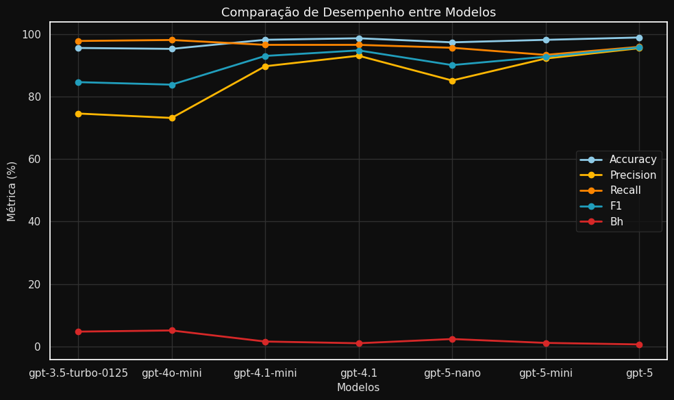
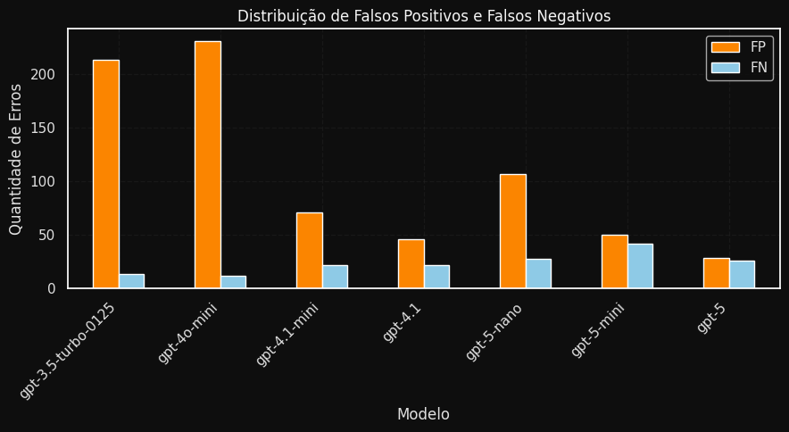
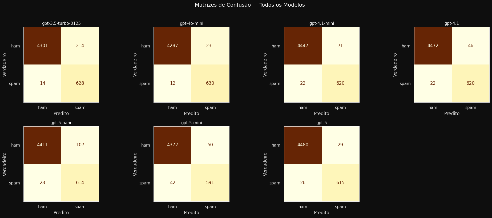
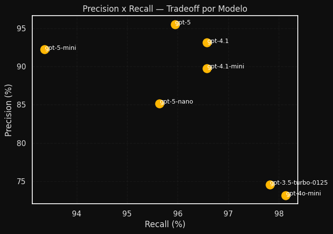
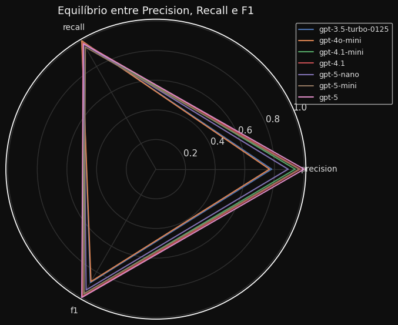

# Benchmark de LLMs para Detecção de Spam em SMS

## Dataset

O experimento utiliza o conjunto de dados **SMS Spam Collection v.1**, disponível no repositório da UCI Machine Learning Repository:

https://archive.ics.uci.edu/dataset/228/sms+spam+collection

**Descrição técnica:**  
O dataset contém 5.574 mensagens em inglês, rotuladas como `ham` (legítimas) ou `spam`.  
O formato original é um arquivo texto tabulado (TSV), com duas colunas: `label` e `text`.

**Distribuição:**  
- Ham: 4.827 mensagens (≈ 86,6%)  
- Spam: 747 mensagens (≈ 13,4%)  

**Autores:** Tiago A. Almeida e José María Gómez Hidalgo (2013).

## Papers

**Referências**

- [ALMEIDA, Tiago A.; GÓMEZ HIDALGO, José María; SILVA, Tiago P. (2013) — *Towards SMS Spam Filtering: Results under a New Dataset.*](papers/2013-Almeida-Towards_SMS_Spam_Filtering_UCI_Dataset.pdf.pdf)
- [SHIRANI MEHR, Hamed; SHAMS, Saeed. (2013) — *SMS Spam Detection Using Machine Learning.*](papers/2013-ShiraniMehr-SMS_Spam_Detection_Using_Machine_Learning.pdf.pdf)
- [ILYASA, Sinar Nadhif; KHADIDOS, Alaa Omar. (2024) — *Optimized SMS Spam Detection Using SVM-DistilBERT and Voting Classifier: A Comparative Study on the Impact of Lemmatization.*](papers/2024-IlyasaKhadidos-Optimized_SMS_Spam_Detection_SVM_DistilBERT.pdf)
## Pré-processamento

O script `src/preprocess.py` realiza a limpeza e estruturação do dataset original para uso em experimentos com LLMs.

**Etapas:**  
1. Leitura do arquivo `data/raw` (formato TSV, sem cabeçalho).  
2. Atribuição de um identificador único (`id`) a cada mensagem.  
3. Normalizações aplicadas:  
   - Decodificação de entidades HTML (`&lt;` → `<`, `&gt;` → `>`)  
   - Normalização Unicode (NFKC)  
   - Colapso de espaços e quebras de linha  
4. Remoção de linhas duplicadas e nulas.  
5. Geração de saídas:  
   - `data/smsspam_dataset.csv` → dataset completo (`id,label,text`)  
   - `data/smsspam_shuffled.csv` → versão embaralhada, sem rótulos (`id,text`)  
   - `data/dataset_info.md` → resumo estatístico

**Decisões de design:**  
- O texto foi mantido com capitalização, pontuação e símbolos originais.  
- Nenhuma lematização, remoção de stopwords ou stemming foi aplicada.  
- O objetivo é preservar o contexto e o tom das mensagens, relevantes para inferência em LLMs.

## Modelos Utilizados

- gpt-5  
- gpt-5-mini  
- gpt-5-nano  
- gpt-4.1  
- gpt-4.1-mini  
- gpt-4o  
- gpt-4o-mini  
- gpt-3.5-turbo
  
## System Prompt

Define a instrução fixa do modelo. O prompt especifica a tarefa de classificação e exige apenas o rótulo como saída:

```
"You are a binary text classifier for SMS messages. "
"Classify each message as exactly one of the following labels:\n"
"- ham: legitimate, personal, or non-promotional content\n"
"- spam: promotional, fraudulent, or unsolicited content\n\n"
"Respond with only the label — 'ham' or 'spam' — without explanation or punctuation."
```

## Criação dos Batches

### `create_all_batches.py`
Gera um arquivo `.jsonl` por modelo em `data/batches/`.  
Cada linha contém uma requisição para a API no formato:

```json
{
  "custom_id": "123",
  "method": "POST",
  "url": "/v1/chat/completions",
  "body": {
    "model": "gpt-4o",
    "messages": [
      {"role": "system", "content": "<SYSTEM_PROMPT>"},
      {"role": "user", "content": "Free entry in 2 a weekly competition..."}
    ]
  }
}
```

### `create_batch_input.py`
Versão simplificada para gerar um único batch (modelo padrão `gpt-3.5-turbo`).

Saída:  
```
data/batches/
 ├── batch_input_gpt-5.jsonl
 ├── batch_input_gpt-4o-mini.jsonl
 └── ...
```


## Submissão dos Batches

### `submit_batch_single.py`
Envia um batch específico:
1. Faz upload do arquivo `.jsonl` para a API.  
2. Cria um job batch com tempo máximo de 24h.  
3. Retorna o `batch_id` para monitoramento.

### `run_all_batches.py`
Itera sobre todos os arquivos em `data/batches/` e envia cada um sequencialmente.  
Usa `extract_model_name()` para identificar o modelo pelo nome do arquivo.  
Armazena logs e trata exceções de falha no envio.


## Download e Parsing dos Resultados

### `parse_batch_output.py`
Após a conclusão de um batch:
1. Faz download do arquivo de saída (`.jsonl`).  
2. Lê cada linha, extrai `id` e `prediction`.  
3. Gera `results/<model>/predictions.csv`.

### `parse_multiple_batches.py`
Processa vários `batch_id` listados em um arquivo texto.  
Baixa, identifica o modelo e converte as respostas para CSV de forma automática.


## Estrutura de Saída

Após o processamento completo:

```
data/
 ├── smsspam_shuffled.csv
 └── batches/
      ├── batch_input_gpt-4o.jsonl
      ├── batch_input_gpt-4o-mini.jsonl
      └── ...
results/
 ├── gpt-4o/
 │    ├── batch_output.jsonl
 │    └── predictions.csv
 ├── gpt-5-mini/
 │    ├── batch_output.jsonl
 │    └── predictions.csv
 └── ...
```

## Resultados 

### Notebook
[evaluate_models.ipynb](notebooks/evaluate_models.ipynb)

### Imagens

**Comparação entre Modelos**  


**Falsos Positivos e Negativos**  


**Matriz de Confusão**  


**Trade-off Precisão vs Recall**  


**Triângulo de Performance**  

